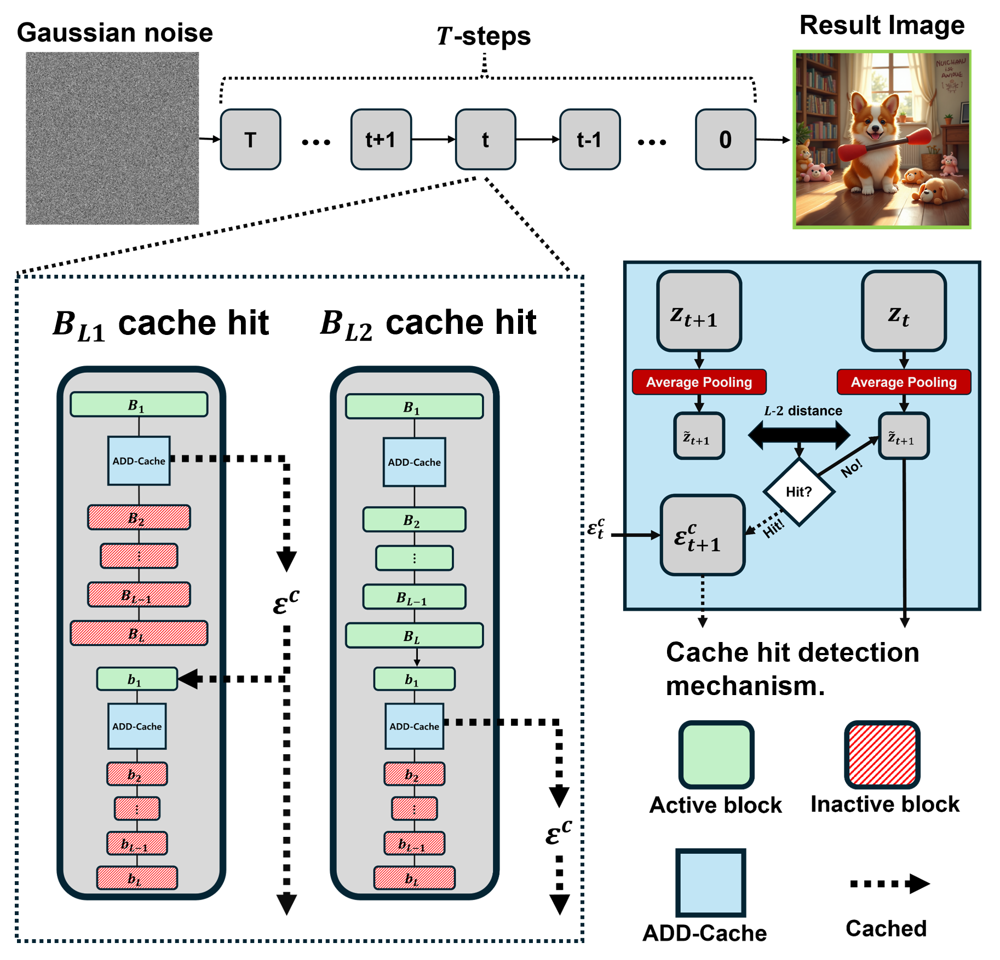

# H2-Cache: A Novel Hierarchical Dual-Stage Cache for High-Performance Acceleration of Generative Diffusion Models

[](https://arxiv.org/abs/2407.XXXXX) [](https://opensource.org/licenses/MIT)

Official implementation of the paper: **H2-Cache: A Novel Hierarchical Dual-Stage Cache for High-Performance Acceleration of Generative Diffusion Models**.

## Abstract

Diffusion models have emerged as state-of-the-art in image generation, but their practical deployment is hindered by the significant computational cost of their iterative denoising process. While existing caching techniques can accelerate inference, they often create a challenging trade-off between speed and fidelity, suffering from quality degradation and high computational overhead. To address these limitations, we introduce **H2-cache**, a novel hierarchical caching mechanism designed for modern generative diffusion model architectures. Our method is founded on the key insight that the denoising process can be functionally separated into a structure-defining stage and a detail-refining stage. H2-cache leverages this by employing a dual-threshold system, using independent thresholds ($\tau_{1}, \tau_{2}$) to selectively cache each stage. To ensure the efficiency of our dual-check approach, we introduce pooled feature summarization (PFS), a lightweight technique for robust and fast similarity estimation. Extensive experiments on the Flux architecture demonstrate that H2-cache achieves significant acceleration—up to 5.08x—while maintaining image quality nearly identical to the baseline, quantitatively and qualitatively outperforming existing caching methods.

---

## 💡 Key Idea: Hierarchical Two-Stage Caching

*Figure 1: Overview of the proposed H2-cache framework.*


The core innovation of H2-Cache is to treat the denoising network not as a single block, but as two functionally distinct stages:

1.  **Structure-Defining Stage ($\mathcal{B}_{L1}$)**: The initial blocks in the network are responsible for establishing the global layout, composition, and overall structure of the image.
2.  **Detail-Refining Stage ($\mathcal{B}_{L2}$)**: The later blocks refine high-frequency details, textures, and subtle features on top of the established structure.

H2-Cache exploits this separation by applying a **hierarchical, two-stage caching mechanism** with independent thresholds for each stage, allowing for more granular control over the speed-quality trade-off.


*Figure 1: Overview of the proposed H2-cache framework.*

### Functional Separation in Action

Caching the structure stage (B<sub>L1</sub>) freezes the image's overall layout, while caching the detail stage (B<sub>L2</sub>) preserves fine textures while allowing the structure to evolve. This demonstrates the clear functional separation our method leverages.


*Figure 2: Qualitative analysis of H2-cache's hierarchical mechanism.*

### Pooled Feature Summarization (PFS)

To make our dual-check strategy computationally efficient, we introduce **Pooled Feature Summarization (PFS)**. Instead of comparing entire high-dimensional tensors, PFS uses fast, hardware-accelerated average pooling to create small "thumbnails" of the feature maps. The similarity check is then performed on these compact summaries, drastically reducing overhead and stabilizing the caching decision process.

---

## 🚀 Setup and Installation

### Dependencies

This project is built upon the **nunchaku** framework. Please follow the installation instructions from the official repository.

1.  **Clone the nunchaku repository:**
    ```bash
    git clone [https://github.com/nunchaku-tech/nunchaku.git](https://github.com/nunchaku-tech/nunchaku.git)
    ```

2.  **Follow the setup guide** provided in the nunchaku repository to install the framework and its dependencies.

### This Repository

After setting up nunchaku, clone this repository:
```bash
git clone [https://github.com/Bluear7878/H2-cache-A-Hierarchical-Dual-Stage-Cache.git](https://github.com/Bluear7878/H2-cache-A-Hierarchical-Dual-Stage-Cache.git)
cd H2-cache-A-Hierarchical-Dual-Stage-Cache
````

-----

## ⚡ How to Use

### Basic Inference with H2-Cache

You can run text-to-image generation with H2-Cache enabled by executing `run.py`.

```bash
python run.py
```

### Reproducing Paper Results (CUTE80)

To reproduce the benchmark results on the CUTE80 dataset, simply run the provided shell script. This will execute the evaluation for all methods (H2-Cache, Block Cache, TeaCache, and Baseline) and save the results.

```bash
bash run_exper.sh
```

-----

## 📊 Results

H2-Cache significantly accelerates inference time while preserving image quality, outperforming existing methods.

### Qualitative Comparison

Our method achieves the best balance of speed and quality, avoiding the artifacts and detail loss seen in other caching techniques.

*Figure 3: H2-cache compared against baselines. Our method is nearly indistinguishable from the baseline while being over 5x faster.*

### Quantitative Comparison

On the CUTE80 dataset, H2-Cache achieves a **5.08x speedup** with a negligible **-0.07%** change in CLIP-IQA score, demonstrating the most effective speed-quality trade-off.

| Method      | Time (s) (Speedup) | CLIP-IQA (Change %)      |
|-------------|--------------------|--------------------------|
| Baseline    | 55.72 (1.00×)      | 0.7693 (-)               |
| Block Cache | 12.82 (4.35×)      | 0.7681 (-0.16%)          |
| TeaCache    | 11.16 (4.99×)      | 0.7462 (-3.00%)          |
| **Ours** | **10.97 (5.08×)** | **0.7688 (-0.07%)** |

-----

## 🔬 Ablation Studies

### Impact of Hierarchical Thresholds

Our hierarchical design with two thresholds ($\\tau\_1, \\tau\_2$) is crucial for optimizing performance. The ideal setting depends on the target metric, validating the need for granular control.

### Impact of Pooled Feature Summarization (PFS)

PFS provides a significant speedup with only marginal impact on image quality, validating it as a highly effective optimization for reducing cache-check overhead.


*Figure 5: PFS stabilizes the similarity metric, leading to more robust caching decisions and faster inference.*

-----

## 🙏 Acknowledgements

This work was supported by the National Research Foundation of Korea (NRF). The implementation relies on the `nunchaku` lightweight framework engine. We thank the authors of the Flux model and the CUTE80 dataset.

-----

## 📜 Citation

If you find this work useful for your research, please consider citing our paper:

```bibtex
@article{sung2025h2cache,
  title={H2-Cache: A Novel Hierarchical Dual-Stage Cache for High-Performance Acceleration of Generative Diffusion Models},
  author={Sung, Mingyu and Kim, Il-Min and Yun, Sangseok and Kang, Jae-Mo},
  journal={arXiv preprint arXiv:2407.XXXXX},
  year={2025}
}
```

-----

## 📄 License

This project is licensed under the MIT License. See the [LICENSE](https://www.google.com/search?q=LICENSE) file for details.

```
```